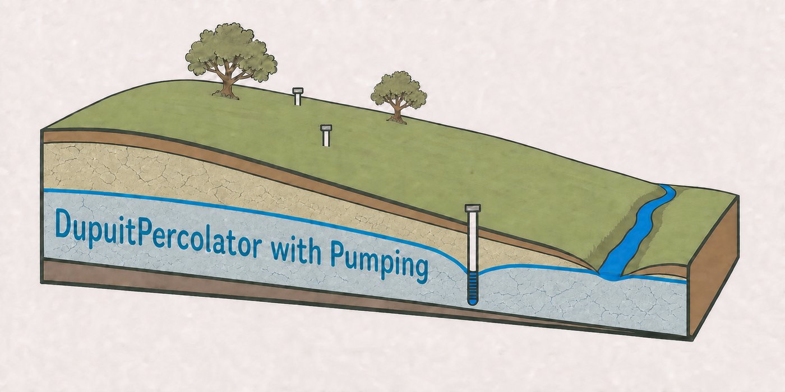

# DupuitPercolator with Pumping

<p align="center">
  
</p>

This repository builds on Landlab's
[`GroundwaterDupuitPercolator`](https://landlab.csdms.io/generated/api/landlab.components.groundwater.dupuit_percolator.html),
developed by David Litwin, Gregory Tucker, Katherine Barnhart, and Ciaran Harman
([Litwin et al., 2020](https://doi.org/10.21105/joss.01935)). That component
provides the two-dimensional Dupuit–Boussinesq groundwater solver.

The `gw_simulator` package adds watershed data preparation, spatially
distributed pumping, paired unimpaired and pumped simulations,
water-availability-limited stream exchange, and reach-resolved streamflow
depletion accounting. It reports changes in total modeled streamflow, aquifer
storage, and flow through each extracted stream reach.

The model is intended for screening and sensitivity analysis. It is not a
calibrated groundwater model unless the user supplies and evaluates calibrated
inputs for a particular site.

## Run the Green Valley example

The repository contains one complete example: the 15.836 km² Green Valley
catchment with 39 stream reaches. The runnable configuration covers water year
2020 and starts from checked-in model states on 2019-09-30.

```bash
git clone https://github.com/daviddralle/gw_simulator.git
cd gw_simulator
mamba env create -f environment.yml
mamba activate boussinesq-pumping
bash example/run.sh
```

The command runs the preflight checks, unimpaired and pumped branches, plots,
and reach tables. New results are written to `example/run`. Checked-in
reference results and figures cover the complete 2010-10-01 through 2024-09-30
simulation and are in `example/results`.
See [`example/README.md`](example/README.md) for the input sources and result
definitions.

## Use another basin

Copy [`example/config.yml`](example/config.yml), replace the input paths, and
run the same workflow:

```bash
python scripts/run_workflow.py --config path/to/config.yml --stage all
```

The required inputs are a watershed polygon, DEM, transmissivity raster,
depth-to-bedrock raster, specific-yield raster, and recharge series. Wells and a
pumping schedule are optional. Preflight checks report missing data, incomplete
date coverage, raster coverage problems, and estimated grid size before the
simulation begins.

## Required model inputs

### Watershed and topography

- A watershed polygon readable by GeoPandas, with a defined coordinate system.
- A georeferenced DEM that covers the watershed.

The DEM defines land-surface elevation, D8 flow routing, the stream network, and
the aquifer top. `scripts/01_extract_dem.py` can obtain a 3DEP DEM through Earth
Engine, but a local DEM can be supplied directly.

### Hydrogeology

The groundwater model consumes three georeferenced rasters:

- transmissivity in m²/day;
- depth to bedrock, interpreted as aquifer thickness, in metres; and
- drainable porosity, interpreted as specific yield, as a fraction from zero to
  one.

Pass these paths explicitly in YAML or on the command line. The model infers
hydraulic conductivity as transmissivity divided by modeled aquifer thickness.
The Green Valley example shows the exact raster formats consumed by the model.

### Recharge

Three input modes are supported:

- `earth_engine_deficit`: watershed-mean recharge calculated from PML V2.2a ET,
  PRISM precipitation, and an unbounded storage deficit;
- `csv`: one basin-mean recharge value in mm/day for every modeled and spin-up
  day; or
- `raster_manifest`: one georeferenced spatial recharge field for every day.

Formats and validation rules are in
[`docs/RECHARGE_INPUTS.md`](docs/RECHARGE_INPUTS.md). Pixelwise Earth Engine
deficit extraction is reserved for future implementation; it is not represented
as an available method.

### Pumping

Pumping is optional. A pumping run requires:

- a point layer with a unique identifier such as `APN`; and
- a CSV that joins on that identifier and contains `waterUse_m3Day` or
  `waterUse_m3Month`.

`timeseries` mode uses dated year-month records. `climatology` mode intentionally
repeats mean calendar-month rates in every modeled year. Pumping can be applied
at mapped well cells or allocated within disjoint topographic source zones.

## Flow and depletion accounting

Daily total modeled streamflow is

```text
total_streamflow = groundwater_to_stream + saturation_excess
```

The standard `routed_volume_limited` method routes surface generation and signed
groundwater exchange through the reach network at every adaptive solver substep.
Potential losing-stream exchange is limited by the water available from upstream
flow and local generation. Channel travel time, storage, and reinfiltration are
not represented.

Streamflow depletion is unimpaired total flow minus pumped total flow. Pumping
response is also tracked as the change in aquifer-storage depletion. Reported
tables distinguish scheduled pumping, storage-limited allocated pumping, modeled
extraction recovered from paired balances, and source-capacity shortfall.

Every run writes `reach_daily.parquet` and `reaches.gpkg`. Local reach values
refer to disjoint incremental catchments and may be summed to recover the basin
total. Routed values include upstream contributions and must not be summed across
reaches. The outlet routed value equals basin flow. Full definitions and enforced
checks are in [`docs/REACH_OUTPUTS.md`](docs/REACH_OUTPUTS.md).

## Principal outputs

- daily unimpaired and pumped water-balance CSVs;
- a daily depletion and pumping-response table;
- hydrograph, depletion, pumping-response, and grid figures;
- requested natural and pumped water-table snapshots;
- reach geometry and daily local/routed reach results; and
- JSON metadata containing configuration, input hashes, code revision, output
  hashes, and numerical validation results.

## Main limitations

- The Dupuit approximation represents an unconfined aquifer with predominantly
  horizontal groundwater flow.
- Stream cells are fixed-head boundaries, subject to the routed water-availability
  limit for losing exchange.
- Reach routing is instantaneous.
- Results depend strongly on transmissivity, aquifer thickness, specific yield,
  recharge, and the representation of pumping sources.
- Reach accounting identifies where the model expresses a flow change; it does
  not attribute that change to a particular well.
- A completed numerical run is not evidence that site parameters are calibrated.

## Development

Python 3.11 or newer is required. Runtime dependencies are declared in
`pyproject.toml`; `environment.yml` also includes Earth Engine, plotting, testing,
and video dependencies used by the complete workflow.

```bash
python -m pytest -q
python example/check_results.py
```
