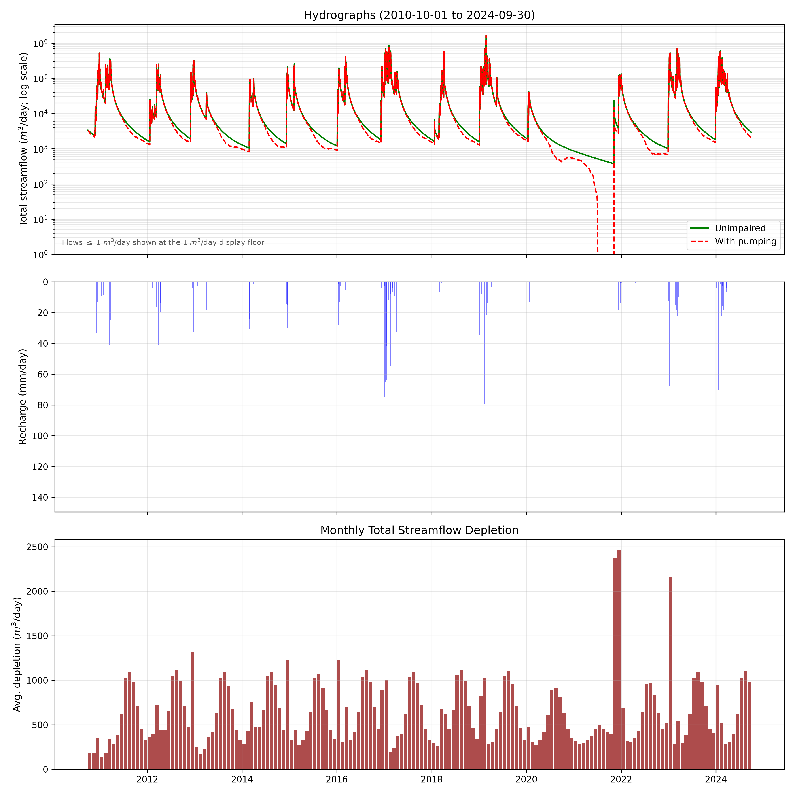
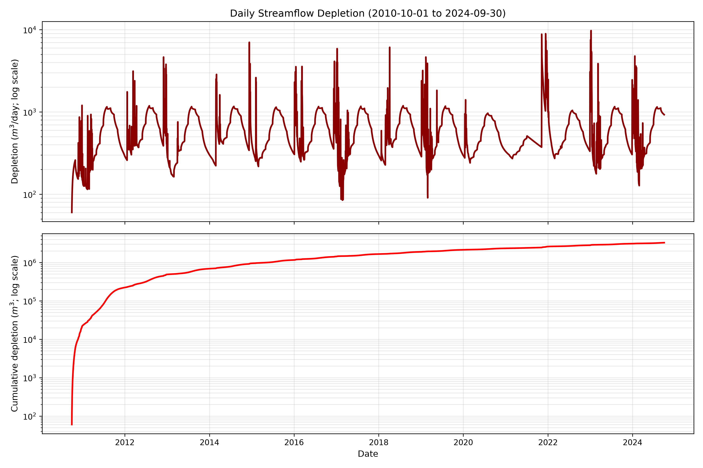
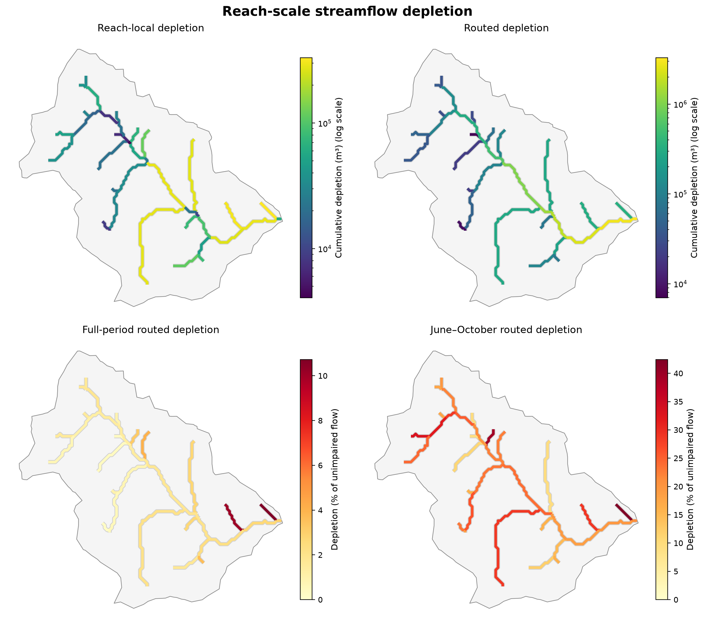
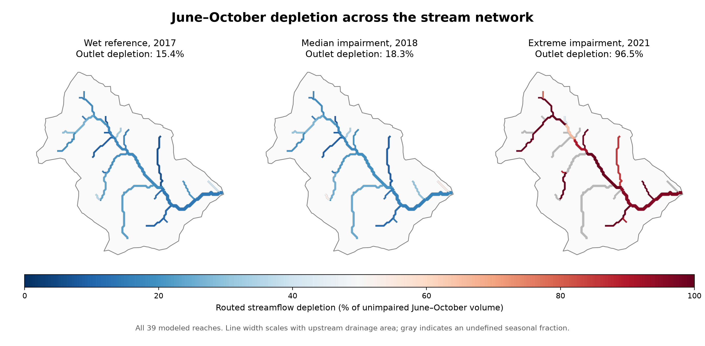
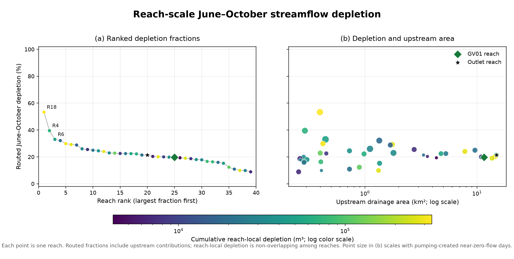

# Green Valley example

This directory is the primary worked example for the repository. It contains
results from the current small Green Valley catchment simulation. The modeled
watershed is 15.836 km² and contains 39 extracted stream reaches. The runnable
configuration covers water year 2020 and uses checked-in unimpaired and pumped
model states from 2019-09-30. The reference results cover 2010-10-01 through
2024-09-30 after an unpumped transient spin-up from 2008-10-01 through
2010-09-30.

Everything needed to run the example is in this directory. From the repository
root, after installing the environment, run:

```bash
bash example/run.sh
```

The simulation writes new files to `example/run` and typically takes about
5–10 minutes on a laptop. The checked-in full-period results used for the
figures below are in `example/results`.

The `inputs` directory contains the watershed boundary, 3DEP DEM, clipped
hydrogeologic rasters, recharge series, anonymized well points, 12-month pumping
climatology, and the two 2019-09-30 model states used to start the example. The
anonymized climatology produces the same spatial pumping forcing as the source
case-study records without distributing parcel identifiers or the full source
table.

## Check the published results

From the repository root, after installing the environment:

```bash
python example/check_results.py
```

The check verifies every published file against `SHA256SUMS`, confirms complete
daily coverage and 39 reaches, and compares the routed outlet series against the
basin depletion table.

To rebuild the five figures displayed below from the checked-in result tables:

```bash
python example/plot_results.py
```

## Inputs and numerical method

The run used:

- a 10 m 3DEP DEM and a 50 m groundwater grid;
- the project's continental/legacy transmissivity raster in m²/day;
- the project's continental/legacy depth-to-bedrock raster in metres;
- the project's continental/legacy storativity raster, interpreted as specific
  yield;
- spatially uniform basin-mean recharge calculated from PML V2.2a ET and PRISM
  precipitation using the storage-deficit method;
- mapped wells and pumping repeated as a calendar-month climatology;
- a 0.25 km² stream-area threshold; and
- the `routed_volume_limited` treatment of losing-stream exchange.

All three hydrogeologic fields were from the continental/legacy set. The files
were formerly stored under a `GLYMPHS` directory, but they are not GLHYMPS 2.0
products. A primary publication or complete processing record for this raster
set has not been recovered, so the case study should not be presented as a
calibrated site model. The packaged inputs reproduce the water-year 2020 portion
of the full simulation.

The exact numerical configuration is in [`config.yml`](config.yml). Input hashes,
code hashes, run dates, and validation results are recorded in
[`results/simulation_metadata.json`](results/simulation_metadata.json).

## Basin hydrograph and depletion





## Reach-network results



Local values describe flow generated along one reach and within its disjoint
incremental catchment. Routed values contain that local contribution and all
upstream contributions. Routed values therefore must not be summed across
reaches.





The GV01-containing reach and the watershed outlet are marked for spatial
reference. These are model results; observed GV01 streamflow is not included in
this public example.

## Machine-readable files

- `streamflow_depletion_timeseries.csv`: daily outlet flow, pumping response,
  storage response, and cumulative diagnostics.
- `simulation_unimpaired_2010-10-01_to_2024-09-30.csv` and
  `simulation_with_pumping_2010-10-01_to_2024-09-30.csv`: daily component water
  balances for the two model branches.
- `recharge.csv` and `transient_spinup.csv`: basin forcing and spin-up
  diagnostics for the case-study run.
- `reach_daily.parquet`: daily local and routed results for every reach.
- `reaches.gpkg`: reach geometry and full-period summary attributes; join on
  `reach_id`.
- `reach_dry_season_summary.csv`: one June–October summary row per reach.
- `reach_dry_season_metrics_by_year.csv`: reach results by dry-season year.
- `simulation_metadata.json`: configuration, input and output hashes, software
  revision, and numerical checks.
- `SHA256SUMS`: checksums for every published case-study file.

Column definitions and interpretation rules are in
[`../docs/REACH_OUTPUTS.md`](../docs/REACH_OUTPUTS.md).

## Interpretation

The model is a screening application. Results are conditional on the
continental/legacy hydrogeology, spatially uniform recharge, fixed-stage streams,
instantaneous reach routing, mapped pumping climatology, and topographic pumping
source zones. Reach results locate where modeled depletion is expressed; they do
not attribute depletion to individual wells or incremental surface catchments.
