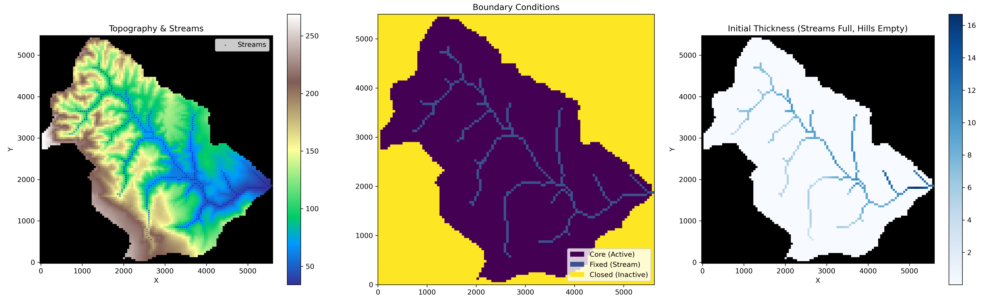
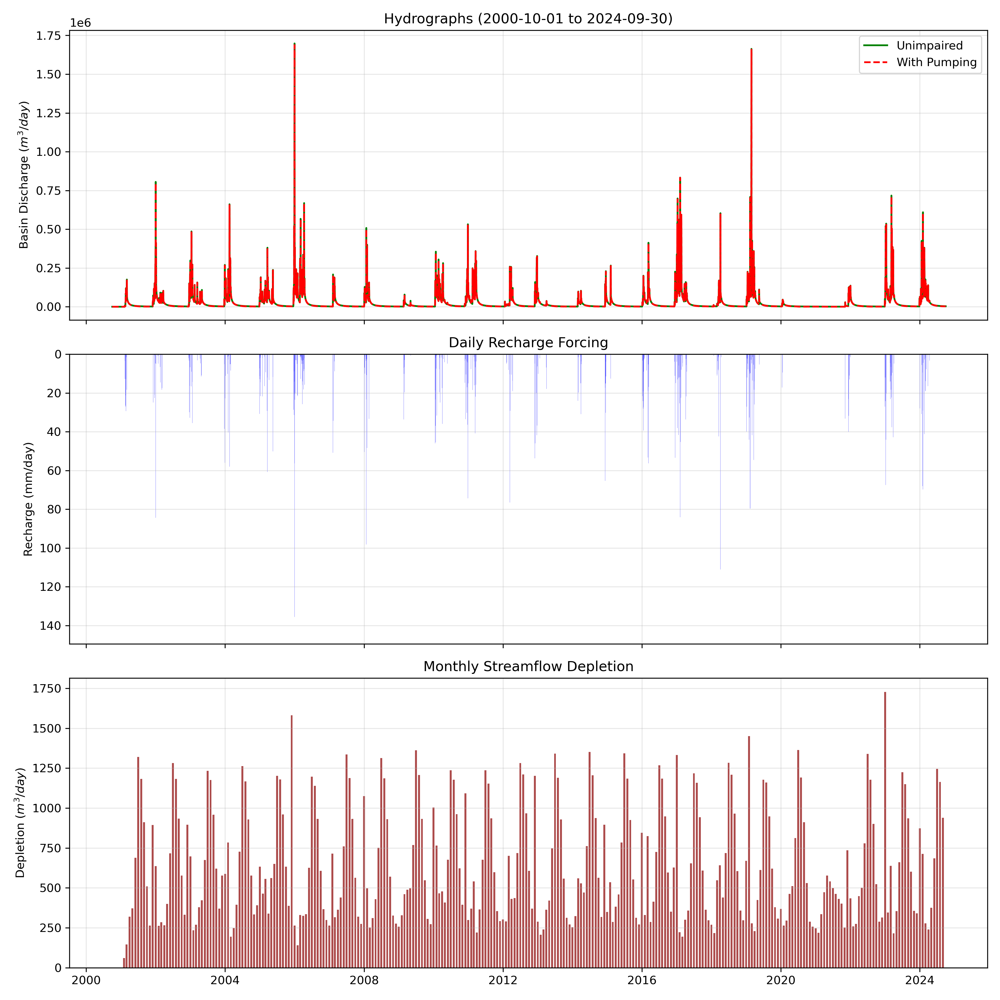
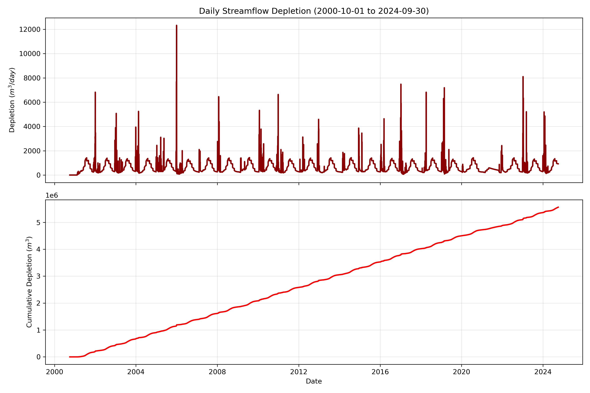
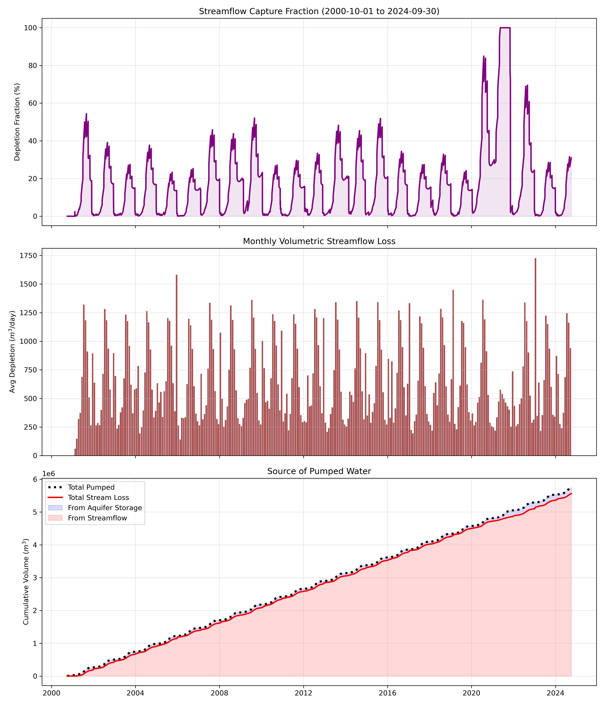
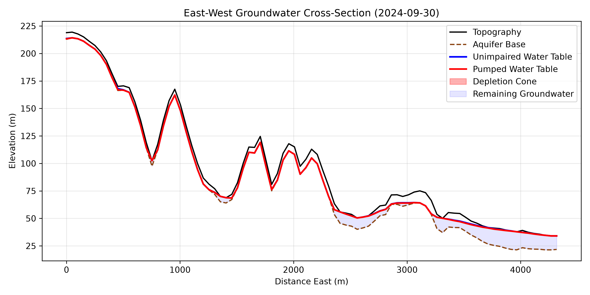

# Green Valley 24-Year Simulation

This example demonstrates how to use `gw_simulator` to run a comprehensive 24-year transient groundwater simulation (from Water Year 2001 through Water Year 2024) for the Green Valley watershed.

## Requirements

Before running this example, ensure that the `data/` directory in the repository root is fully populated. Specifically, it must contain:

- `comid_8273277.gpkg`: The catchment boundary.
- `well_locations.gpkg`: Point locations of groundwater wells in the catchment.
- `GVDB/pumpingSchedule.csv`: Monthly pumping schedules associated with the wells.
- `GLYMPHS/`: The folder containing `transmissivity_m2d.tif`, `depthToBedrock_m.tif`, and `storativity.tif`.

*(Note: The DEM and recharge time series are automatically downloaded and generated by the script!)*

## Running the Example

You can execute the entire 24-year simulation by running the provided shell script:

```bash
bash run.sh
```

### What this script does:

1. **Executes `03_run_groundwater.py`**:
   - Routes the daily recharge from `2000-10-01` to `2024-09-30`.
   - Skips the steady-state spin-up to save time, assuming a fully saturated aquifer base condition.
   - Simulates two parallel scenarios: an **Unimpaired (Natural)** run, and a **With Pumping** run.
   - Calculates the streamflow depletion caused by the pumping by comparing basin-scale discharge between the two scenarios.
   - Saves daily mass balance summaries, depletion time series, and comprehensive diagnostic plots (hydrographs and capture fraction) to the `outputs/gv_24_year/` directory.

2. **Executes `04_plot_cross_sections.py`**:
   - Takes the final day's water table snapshot (`2024-09-30`).
   - Automatically finds the location of maximum depletion in the grid.
   - Generates a 2D East-West cross-section across the watershed, plotting the topography, bedrock, natural water table, and the final pumped depletion cone.

## Outputs

All outputs, including CSVs and `.png` plots, will be saved locally inside the example folder:
`examples/green_valley/outputs/`

Here are the key visual outputs generated by the simulation:

### Grid Setup

*This plot visualizes the grid construction, highlighting the active domain, the extracted stream network, and the interpolated transmissivity fields.*

### Hydrographs

*Comparative hydrographs showing the natural (unimpaired) streamflow versus the streamflow when groundwater pumping is active.*

### Streamflow Depletion

*A time series of the absolute volumetric streamflow depletion caused by pumping over the 24-year period.*

### Capture Fraction

*The capture fraction (depletion rate divided by pumping rate) over time, showing how the depletion scales relative to the pumping stress.*

### End-of-Season Depletion Cone Cross-Section

*A 2D spatial cross-section taken at the location of maximum depletion at the end of the 2024 dry season. It highlights the unimpaired water table versus the lowered pumped water table.*
